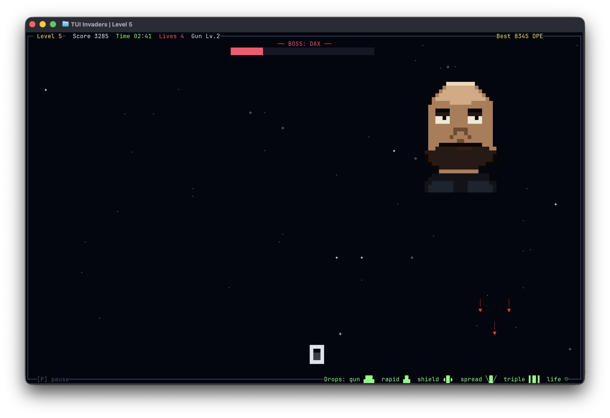

# TUI Invaders

A terminal Space Invaders game built with [OpenTUI](https://github.com/anomalyco/opentui).



Features:

- True pixel-art ships via half-block rendering with per-cell colors
- Animated boss fights (Dax) every 5 levels with a health bar and explosion
- Power-up drops: gun upgrade, rapid fire, shield, spread, triple shot, life (rare)
- Starfield background, animated particles
- Persistent high scores
- Pause dialog

## Requirements

[Bun](https://bun.sh) `>=1.0.0`

## Install

```sh
# run directly with bunx (no install)
bunx tui-invaders

# or install globally
bun install -g tui-invaders
tui-invaders
```

## Controls

| Key      | Action |
| -------- | ------ |
| `← / A`  | Move left |
| `→ / D`  | Move right |
| `Space`  | Shoot |
| `P`      | Pause / resume |
| `R`      | Restart after game over |
| `Ctrl+C` | Quit |

High scores are saved to a per-platform data directory:

- Linux: `$XDG_DATA_HOME/tui-invaders/highscores.json` (defaults to `~/.local/share/tui-invaders/`)
- macOS: `~/Library/Application Support/tui-invaders/highscores.json`
- Windows: `%APPDATA%\tui-invaders\highscores.json`

## Develop

```sh
bun install
bun run start
bun run check
```

## License

MIT
