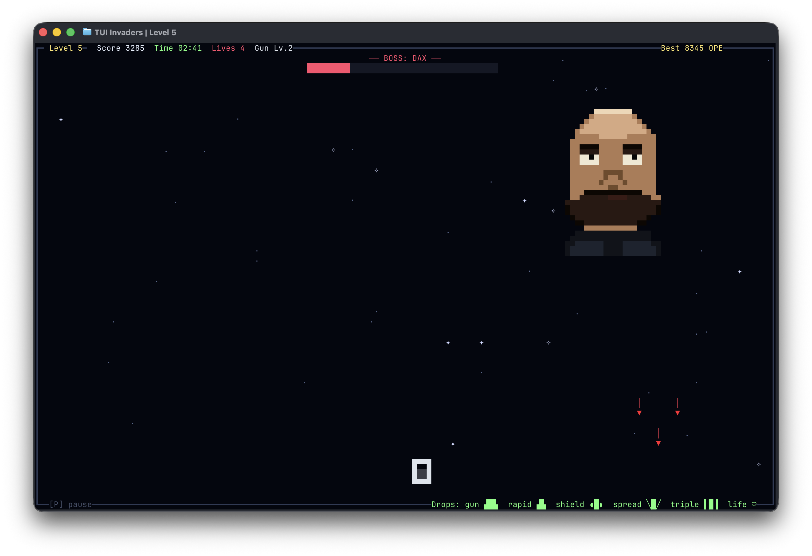

# 🛸 TUI Invaders

The classic Space Invaders experience, rebuilt for your terminal.

Built with [OpenTUI](https://github.com/anomalyco/opentui) for buttery-smooth terminal rendering.



## Features

- 🎨 **True pixel-art ships** — half-block rendering with per-cell colors for crisp visuals
- 🕹️ **Four-direction flight** — move freely in the lower half of the arena with arrows or WASD, including diagonals. Fly closer for faster hits or hang back for more reaction time; enemies must cross a fixed bottom defense line, not your current altitude
- 👾 **Boss fights** — starting at level 3, then every 3 levels, with health bars and explosive finales
- 🐋 **Special operations** — after losing 25% health, Dax at level 6 calls in Operation Cheepseek's whale escorts, while Luke / Hona at level 9 calls in Gemini For Life's twin stars. Cinematic backup calls transition automatically back into combat. Kit arrives at level 12; subsequent bosses return to Dax with rotating shooting styles
- 🧩 **Kit // The Effect Evangelist** — level 12 starts immediately, without an arrival cinematic. At 75% health, “Rewrite in Effect!” becomes a large arcade headline and two Extensions shield Kit. Destroy them to damage him again. At 50%, “Endomorphisms are inherently monoidal!” introduces aimed bursts and three new shield Extensions. Both power-up scenes restore 15% of maximum health and clear old attacks; tips follow the reveal. Gold Extensions warn before firing. Defeating Kit awards 3,000 points and a brief crying-portrait farewell: “Fine. I'll blog about this.” The next wave follows automatically
- 🛸 **Boss reinforcements** — Dax refills three whales every nine seconds; Luke refills four Gemini stars every 5.5 seconds. Fewer survivors get wider patrol routes; defeating the boss takes down the whole squad. Boss fights allow up to six pickups, with a three-second drop cooldown
- 🌠 **Gemini For Life** — Luke fires left/center/right twin volleys in randomized order, with a return-fire window. Four-point stars ease through patrol turns; wounded stars mark a fixed dive lane, then grow into smoothly accelerating falling stars. Once a dive is signaled, shots pass through: dodge the star! Stars are killable before committing, and defeating Luke clears all remaining stars
- ⚡ **Power-up drops** — gun upgrade, rapid fire, shield, spread, triple shot, and the elusive extra life
- 🎯 **Earn your upgrades** — clearing a wave grants 1 permanent gun XP (2 for bosses); gun pickups add extra XP. The second barrel unlocks at level 4, damage caps at four per bullet at level 5, and firing speed improves from level 6. Level 7 adds piercing; extra barrels come only from temporary pickups. Boss damage can shake loose supplies, with paced, need-aware drops rather than a loot shower
- 🦋 **Weavers** — from wave 10, bow-tie-shaped ships alternate a three-shot outward fan with two inward-crossing shots, leaving 2.8 seconds between volleys. Their armor matches bruisers and snipers
- 🔥 **Bosses keep up** — later bosses gain substantially more health without scaling to your pickups. Aimed bursts target your current lane and leave shorter recovery windows below half health
- 💪 **Stronger, not just more** — regular formations grow slowly to at most 24 ships (fewer in small terminals). Scouts stay fragile; bruisers and snipers are armored for two full volleys, bursters and dreadnoughts for three. Armor follows wave progression rather than your pickups, so extra upgrades still give you an edge
- 🎯 **High-speed sniper shots** — snipers launch faster aimed shots than other regular enemies, with projectile speed keeping pace as difficulty rises
- ✨ **Starfield background** with animated particles for that arcade atmosphere
- 🏆 **Persistent high scores** — compete with yourself (or your friends)
- ⏸️ **Pause anytime** — because life happens

## Requirements

- [Bun](https://bun.sh) `>=1.3.0`

## Quick Start

```sh
# Play instantly (no install required)
bunx tui-invaders

# Or install globally
bun install -g tui-invaders
tui-invaders
```

Jump straight to a level with `--level` (Hona is level **9**, Kit is **12**):

```sh
tui-invaders --level 9
# From this repository:
bun run start --level 9
# Kit's encounter:
bun run start --level 12
```

Restarting returns to the selected level. You begin with the usual starting lives
and gun. Kit has mid-fight cinematics at 75% and 50% health, without an arrival intro;
Dax and Hona call backup after losing 25% health.

Power-up cinematics restore 15% of the boss's maximum health when they finish
(capped at full health). Hona's level-9 stars have 24 HP, enough to survive a
level-6 full volley and begin their dive warning. Aimed enemy shots stay within
a downward cone rather than firing sideways or upward.

## Controls

The start screen lets you choose **OpenCode** or **OpenCodeJr**. Jr keeps its
googly eyes in the selection preview and wears dark shades during gameplay.
Use Left/Right or A/D to choose, then Enter or Space to launch.
Both use the same gun progression. Restart returns to selection and remembers
your last choice. Embedded hosts can call `game.start()` to launch directly.

| Key      | Action           |
| -------- | ---------------- |
| `← / A`  | Move left        |
| `→ / D`  | Move right       |
| `↑ / W`  | Move up          |
| `↓ / S`  | Move down        |
| `Space`  | Shoot            |
| `P`      | Pause / resume   |
| `R`      | Restart (on game over) |
| `Ctrl+C` | Quit             |

Diagonal movement has the same overall speed as straight flight. Resizing
preserves your relative altitude. A hit briefly flashes the ship and gives
you time to retreat; ramming a boss costs a life without defeating it.

## High Scores

Your best scores are saved automatically:

| Platform | Location                                                          |
| -------- | ----------------------------------------------------------------- |
| Linux    | `$XDG_DATA_HOME/tui-invaders/highscores.json` (or `~/.local/share/tui-invaders/`) |
| macOS    | `~/Library/Application Support/tui-invaders/highscores.json`      |
| Windows  | `%APPDATA%\tui-invaders\highscores.json`                          |

## Development

```sh
# Install dependencies
bun install

# Run in development mode
bun run start

# Type-check
bun run check

# Run tests
bun test
```

## Embedding

The standalone game and embedded integrations share the same host-driven game
session. Import `InvadersGame`, provide dimensions, forward input, and render it
into an OpenTUI `TextRenderable` owned by your application:

```ts
import { InvadersGame } from "tui-invaders/embed"

const game = await InvadersGame.load(width, height)
game.step()
game.draw(canvas)
```

Use `game.press(key)` / `game.release(key)` for held-key input (including
simultaneous directions). For terminals or hosts without release events, use
`game.tap(key)` on each press/repeat so movement stops when events stop.

## License

MIT

bright rules
